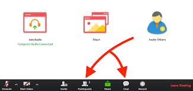

```{r setup, include=FALSE}
options(htmltools.dir.version = FALSE)
library(countdown)
```
class: bottom, center
background-image: url(images/Rfun1.png)

[Rfun](https://rfun.library.duke.edu): An R Learning Event

.scriptsize[Part of the]<br>
[Center for Data &amp; Visualization Sciences Workshop Series](https://library.duke.edu/data/workshops)

&nbsp;
---
## Dashboards, Slides & Markdown

An [Rfun](https://rfun.library.duke.edu/) workshop

### Please

1. Enter your name in the attendance form & take pre-workshop survey

    - https://is.gd/nucCNr
    
2. Links for resources can be found in the Zoom chat.  




```{r echo=FALSE}
print("We will begin in...")
countdown(17)
```


---

# John Little

&nbsp;

.pull-left[.full-width[.content-box-green[
### Data Science Librarian

- https://johnlittle.info/

- https://github.com/libjohn
]]

### Rfun host...
You can make **Rfun** with our resources for R and data science analytics.  See the [R we having fun yet‽](https://rfun.library.duke.edu/) resource pages.
]

.pull-right[.content-box-grey[
### Duke University

**Center for Data & Visualization Sciences**

- https://library.duke.edu/data/
- askData@Duke.edu
- The /Edge, Bostock (1st Floor)
- [Past Workshops](https://library.duke.edu/data/news/past-workshops)
- [Guides & Tutorials](https://library.duke.edu/data/tutorials)

]]

